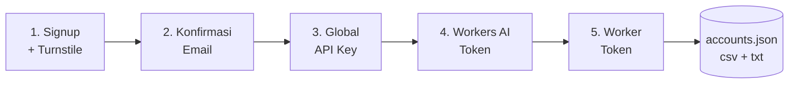

<div align="center">

# ☁️ cf-auto

**Cloudflare account factory — signup sampai semua credential, satu perintah.**

[](https://www.python.org/)
[](https://github.com/daijro/camoufox)
[](#per-os)
[](#license)

</div>

---

Automation berbasis **Camoufox** (anti-detect Firefox) + **TempMailByJhopanstore** (temp mail self-hosted).
Jalan **headed** di Windows, **virtual display (Xvfb)** di server Linux — tanpa monitor, tanpa minimize-masalah.

## ✨ Apa yang Dilakukan

Satu perintah, 5 modul berurutan, semua credential terkumpul:



| # | Modul | Hasil |
|---|---|---|
| 1 | Signup | Akun CF baru + solve Turnstile otomatis (5 lapis strategi) |
| 1b | Email sudah terdaftar? | Fallback: login → reset password via email → lanjut |
| 2 | Konfirmasi Email | Verify via workers-and-pages (satu tab, tanpa tab baru) |
| 3 | Global API Key | Kode verifikasi email → modal View → API Key |
| 4 | Workers AI Token | Token `cfut_...` (nama sesuai config) |
| 5 | Worker Token | Template "Edit Cloudflare Workers" + resources otomatis |

## 🛡️ Anti-Abuse & Anti-Stuck

| Fitur | Default | Config |
|---|---|---|
| Kuota harian (hitung dari accounts.json per tanggal) | 10 akun/hari | `limits.max_per_day` |
| Jeda antar akun + countdown log | 5 menit | `limits.delay_between_minutes` |
| Kill browser antar akun (anti numpuk memori, fresh start) | ON | `limits.kill_browser_between` |
| Email "already exists" → login/reset otomatis | ON | otomatis |
| Turnstile 5 strategi: klik iframe → mouse → text → **injected widget** → manual | otomatis | — |
| Notif Telegram + screenshot saat butuh klik manual | ON jika disetup | `telegram.*` |

**Notif Telegram** — setup via menu 4 → 7 (bot token dari @BotFather, chat ID
terdeteksi otomatis). Kalau semua strategi Turnstile gagal, runner kirim
screenshot + link VNC, tunggu klik manual (default 10 menit, config
`manual_timeout_minutes`), lalu lanjut otomatis setelah solved.

**Reset password otomatis** — signup ditolak karena email pernah daftar?
Runner login dengan password config; kalau salah, buka
`dash.cloudflare.com/forgot-password` → ambil reset code dari URL di email →
set password baru → login → lanjut modul 2-5. Password final tersimpan.

## 📦 Output — 3 Format Sinkron

```
cf-auto/
├── accounts.json     ← JSON lengkap (semua field)
├── accounts.csv      ← CSV untuk Excel/Sheets
└── workers_ai.txt    ← name|apiKey|accountId (siap copas)
```

**workers_ai.txt** (1 akun = 1 baris):
```
michael|cfut_XXXXXXXXXXXXXXXXXXXXXXXXXXXXXXXXXXXXXXXXXXXX|022c8d2a183e0f78c9c05187ff726f76
emily|cfut_YYYYYYYYYYYYYYYYYYYYYYYYYYYYYYYYYYYYYYYYYYYYYY|aff95feb33528e6f04cdee01100d3bdf
```

✅ **Dedup** — email dobel ditolak di semua format
✅ **Append** — data lama tidak pernah dihapus
✅ **Konsisten** — ketiga file selalu sinkron

## 🚀 Quick Start

```bash
git clone https://github.com/jhopan/cf-auto.git
cd cf-auto
bash install.sh
python menu.py    # isi API key temp mail + pilih mode browser
```

Buat akun:

```bash
python main.py --count 1     # 1 akun
python main.py --count 5     # 5 akun
```

Contoh output:

```text
═══ Akun #1 SELESAI ═══
  Email         : emily@renunganbot.qzz.io
  Global API Key: cfk_PgW0...xxxx
  Workers AI    : cfut_cZbk...xxxx
  Worker Token  : cfut_vG2Y...xxxx
  Account ID    : aff95feb33528e6f04cdee01100d3bdf
  → accounts.json
  → accounts.csv
  → workers_ai.txt (format: name|apiKey|accountId)
```

## 🖥️ Super Menu

```bash
python menu.py
```

```text
====================================================
       MENU CFAUTO
====================================================
  Mode: wordlist | wordlist: 17/20 available
====================================================
  1. Lihat config sekarang
  2. Atur Temp Mail (endpoint/domain/key)
  3. Atur Password (random/fixed)
  4. Atur Browser (visible/headless/virtual)
  5. Atur Penamaan Email (format/wordlist)
  6. Atur Storage (file output)
  7. Lihat akun tersimpan
  8. Jalankan runner (1/multi/wordlist)
  9. Keluar
```

## 🔤 Penamaan Email

Dua mode, diatur via **menu 5**:

**Format** — template dengan placeholder:

| Placeholder | Hasil | Contoh |
|---|---|---|
| `{prefix}` | dari config | `cf` |
| `{rand8}` | 8 char acak | `8g13m7dq` |
| `{rand6}` | 6 char acak | `a3f9x2` |
| `{randnum}` | 6 digit angka | `739214` |

```json
"email_format": "{prefix}{rand8}"   → cfw2sf4s6q@domain.com
```

**Wordlist** — baca `wordlist.csv`, bisa diedit di Excel:

```csv
nomor,nama,status
1,jhon,
2,michael,used
3,sarah,
```

- Baris `status` kosong = available → dipakai → otomatis ditandai `used`
- Habis semua? → fallback random otomatis (tidak pernah berhenti)
- Sub-menu: lihat statistik / reset status

## 🌐 Mode Browser (menu 4)

| Mode | Kegunaan | Turnstile |
|---|---|---|
| `visible` | Windows — lihat browser jalan | ✅ terbaik |
| `virtual` | **Linux/VPS/home server** — Xvfb 1920×1080 otomatis | ✅ terbukti |
| `headless` | tanpa window | ⚠️ lebih sulit, hindari |

> Mode `virtual` memulai Xvfb resolusi penuh sendiri (bukan 1×1 bawaan Camoufox),
> browser headed di atasnya → `visibilityState` selalu `visible` → Turnstile solved
> tanpa dipantau. Xvfb di-kill otomatis setelah selesai.

## ⚙️ Config Reference

<details>
<summary><b>config.json</b> (klik untuk expand)</summary>

```json
{
  "temp_mail": {
    "base_url": "https://tempmail.example.com",
    "api_key": "",
    "domains": ["example.com"],
    "prefix": "cf",
    "email_format": "{prefix}{rand8}",
    "naming_mode": "format",
    "wordlist_file": "wordlist.csv"
  },
  "password": { "mode": "random", "fixed": "", "length": 16 },
  "browser": {
    "headless": "virtual",
    "proxy": "",
    "vnc": false,
    "vnc_mode": "permanent",
    "vnc_display": ":98",
    "vnc_port": 6081,
    "vnc_domain": "vnc-cfauto.example.com"
  },
  "limits": {
    "max_per_day": 10,
    "delay_between_minutes": 5,
    "kill_browser_between": true
  },
  "telegram": {
    "bot_token": "",
    "chat_id": "",
    "notify_manual": true,
    "manual_timeout_minutes": 10,
    "notify_success": false
  },
  "storage": {
    "accounts_file": "accounts.json",
    "csv_file": "accounts.csv",
    "workers_ai_file": "workers_ai.txt",
    "workers_ai_format": "{name}|{apiKey}|{accountId}",
    "csv_enabled": true,
    "workers_ai_enabled": true,
    "append": true,
    "dedupe_field": "email"
  }
}
```

</details>

<details>
<summary><b>API Temp Mail</b> (TempMailByJhopanstore)</summary>

Header: `X-Email-API-Key: <api_key>`

| Endpoint | Fungsi |
|---|---|
| `POST /api/inbox` | Buat inbox `{username, domain}` |
| `GET /api/inbox/{email}/wait` | Tunggu email masuk (long-poll) |
| `DELETE /api/inbox/{email}` | Hapus inbox |
| `GET /health` | Cek server |

</details>

## 🖥️ Per OS

| | Windows | Linux/VPS |
|---|---|---|
| Mode | `visible` | `virtual` |
| Xvfb | — | ✅ auto-install via install.sh |
| Python deps | global | venv otomatis (PEP 668) |
| Minimize window | ❌ jangan (Turnstile suspend) | tidak relevan — virtual selalu visible |
| Jalankan | `python main.py` | `./venv/bin/python main.py` |

## 🏠 Deploy di Home Server

```bash
ssh server-anda
git clone https://github.com/jhopan/cf-auto.git && cd cf-auto
bash install.sh            # venv + camoufox + Xvfb + playwright deps
python menu.py       # menu 2: api key → menu 4: pilih 3 (virtual)
./venv/bin/python main.py --count 10
```

Bonus: IP residential rumah = trust Cloudflare tinggi = Turnstile lebih ramah daripada VPS datacenter.

## 🧰 Troubleshooting

| Masalah | Solusi |
|---|---|
| `externally-managed-environment` | Sudah otomatis — install.sh buat venv; jalankan via `./venv/bin/python` |
| Turnstile stuck di virtual | Pastikan Xvfb 1920×1080 (runner sudah handle) + jangan headless |
| `Tidak ada domain mail yang berhasil membuat inbox` | Cek `api_key` di config & server up (`/health`) |
| `wordlist CSV harus punya kolom` | Header harus persis: `nomor,nama,status` |
| `NS_ERROR_ABORT` saat navigasi | Retry otomatis 3× + jeda 5s — biarkan script jalan |
| Klik meleset / elemen bergeser | Viewport mismatch — pastikan pakai mode `virtual` (runner set windowSize 1920×1080) |
| Banyak task asyncio error saat exit | Normal saat browser ditutup, abaikan |

## 📁 Struktur Project

```
cf-auto/
├── main.py              # Entry: loop akun + limits + kill browser
├── menu.py              # Super menu interaktif
├── config.py            # Config + storage + wordlist engine
├── vnc.py               # VNC stack manager (Xvfb/x11vnc/noVNC/tunnel)
├── install.sh           # Installer cross-platform
├── config.example.json  # Template config
├── wordlist.csv         # Nama email (nomor,nama,status)
├── cf-modules/
│   ├── cf_helpers.py    # Shared: Turnstile 5 strategi, fill, click
│   ├── cf_signup.py     # Modul 1a (deteksi email taken)
│   ├── cf_login.py      # Modul 1b (fallback login)
│   ├── cf_reset_pass.py # Modul 1c (reset password via email)
│   ├── cf_telegram.py   # Notif Telegram (manual help)
│   ├── cf_confirm_email.py # Modul 2
│   ├── cf_get_apikey.py # Modul 3
│   ├── cf_workers_ai.py # Modul 4
│   └── cf_worker_token.py # Modul 5
└── docs/                # PRD, arsitektur, testing
```

## 🔒 Security

- `config.json`, `accounts.*`, `workers_ai.txt`, `runner_result.json` → **gitignored**, tidak pernah masuk repo
- Password & token hanya tersimpan lokal
- Rotasi API key temp mail jika terpapar log/screenshot
- Gunakan **hanya untuk akun & domain milik sendiri** — ikuti [Cloudflare Terms](https://www.cloudflare.com/terms/)
- Bukan alat untuk mass-abuse; rate Cloudflare & temp mail tetap Anda tanggung jawab

---

<div align="center">

**Credit: JhopanStore** · Temp mail: [TempMailByJhopanstore](https://github.com/jhopan/TempMailByJhopanstore)

</div>
